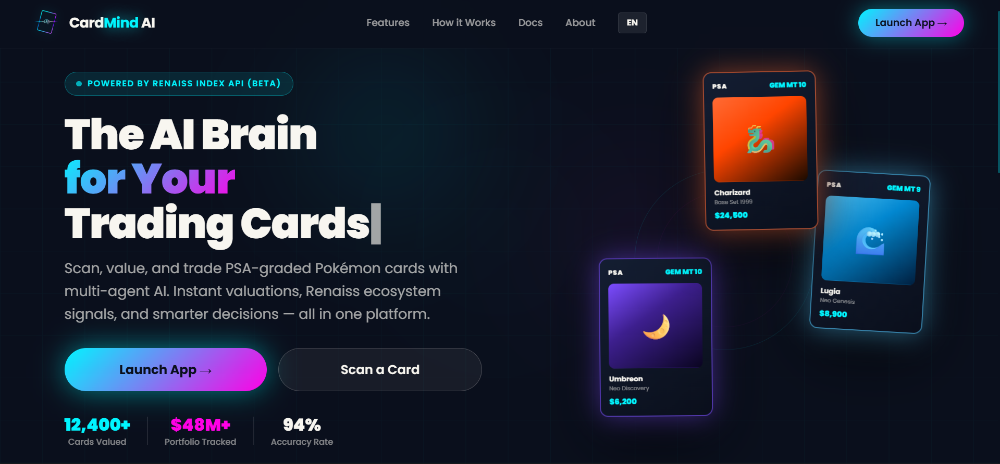

# CardMind AI 🧠

**An intelligent multi-agent assistant for PSA-graded Pokémon card collectors**, built with real integration to the Renaiss ecosystem.

Trading card markets are currently fragmented, lacking real-time liquidity signals and transparent valuations. CardMind solves this by combining multi-agent AI analysis with live blockchain metrics, turning static card collections into dynamic, data-driven portfolios.

**🌐 Try the Live App:** [https://cardmind-ai.vercel.app/](https://cardmind-ai.vercel.app/)



## 🌟 Features
- **Smart Scanning**: Scan graded cards via image upload or PSA certification / token ID number.
- **Multi-Language Support (EN / 中文 / 日本語)**: Full UI localization across English, Simplified Chinese, and Japanese with a language selector dropdown. AI chat responses are also dynamically translated to the user's selected language.
- **Custom Web3 Wallet Integration**: Connect seamlessly via MetaMask, OKX, Binance, Trust Wallet, and TokenPocket with intelligent mobile deep-linking support.
- **On-Chain Verification**: View tokenized versions of your physical cards with direct BscScan links and live portfolio fetching via ethers.js.
- **Live Market Insights**: Real-time marketplace data pulled directly from the Renaiss API — browse live card listings, search by name, and view aggregate market stats (total value, average price, top sets, grade distribution).
- **Renaiss API Integration**: Get real-time valuations, liquidity scores, and market signals powered by the Renaiss Index API.
- **Portfolio Analytics**: Track your collection with gallery/list/analytics views, grade distribution charts, performance tracking, and P&L calculations (wallet-connected).
- **AI Advisor Chat**: Context-aware chat powered by Groq (Llama 3) that understands your portfolio, active scans, and Renaiss signals to give personalized buy/hold/sell recommendations — in your selected language.
- **Intelligent Error Handling**: Fully customized in-app toast notifications for rate-limiting, wallet errors, and API timeouts with graceful N/A fallbacks for missing data.

## 🏗️ Architecture & How It Works
1. **Input**: User uploads a card image or inputs a PSA cert / token ID number.
2. **AI Extraction**: Multi-agent system (Card ID Agent, Grade Verifier, Market Agent, Renaiss Agent, Valuation Agent) works together to identify the card, verify the grade, and pull market data.
3. **Market Query**: We query the Renaiss API (`/v0/index`, `/v0/marketplace`) to fetch real-time price data, liquidity scores, and on-chain signals.
4. **Blockchain Link**: The system queries the corresponding token ID and links the physical asset to its on-chain representation on the BNB Smart Chain.
5. **Localization Context**: A React context provider passes language state to the UI and injects system instructions into the LLM prompts for native translation across English, Chinese, and Japanese.
6. **AI Chat**: Groq-powered Llama 3 model receives full portfolio context, active scan data, and Renaiss signals to generate intelligent, personalized advice.

## 🛠️ Tech Stack
- **Frontend**: React 19 + Vite + TypeScript
- **Styling**: Tailwind CSS v4 (Custom dark mode & neon aesthetics)
- **Data Visualization**: Recharts (Area charts, Bar charts, Pie charts)
- **AI Engine**: Groq API (Llama 3 — 70B)
- **Web3**: Ethers.js v6 / Custom Wallet Selector Modal
- **Data Provider**: Renaiss Index API (Live integration — `/v0/index` & `/v0/marketplace`)
- **Localization**: Custom React Context with EN, 中文, and 日本語 locale files

## 🚀 How to Run Locally

1. Clone the repository and install dependencies:
```bash
git clone https://github.com/Cryptojigi/CardMind.git
cd CardMind
npm install
```

2. Create a `.env` file with your API keys:
```bash
VITE_GROQ_API_KEY=your_groq_api_key_here
```

3. Start the development server:
```bash
npm run dev
```

*Note: The app connects to the real Renaiss Index API. If rate limits are hit or the network fails, the app uses an intelligent toast notification system to alert the user without crashing. Missing data fields gracefully display "N/A" instead of broken values.*

## 🏆 Important Notes for Judges

- The app uses the **real Renaiss Index API** for fetching market data and on-chain links — no hardcoded mock data in the Market Insights page.
- The **Market Insights** page pulls live card listings from the Renaiss marketplace API with real-time search, aggregated stats, and set distribution analytics.
- All AI chat responses are highly contextualized, pulling from the user's active scans and portfolio data, and support dynamic translation across 3 languages.
- **Graceful Data Handling**: When the API doesn't return certain fields (price history, rarity, liquidity score), the UI shows "N/A" instead of broken/empty states.
- **Aesthetic Focus**: We spent significant time ensuring the UX/UI feels premium, snappy, and fully mobile-responsive.

## 🎯 Built For

**Renaiss Tech Hackathon Season 1** – AI, Game & Tool Sprint

## 🔗 Links

- **Live App**: [https://cardmind-ai.vercel.app/](https://cardmind-ai.vercel.app/)
- **X (Twitter)**: [https://x.com/CardMindAI](https://x.com/CardMindAI)
- **GitHub**: [https://github.com/Cryptojigi/CardMind](https://github.com/Cryptojigi/CardMind)

## 📄 License

MIT
